# Link Shortening Service — **Frontend**

A clean, static frontend (HTML/CSS/JS) for **Short.ly** that talks to the Spring Boot backend.
It supports **registration & login**, **JWT access tokens** with **auto refresh**, **URL shortening** with options, and **statistics** (public and per-user).

> Tech: **Vanilla JS (no framework)** • **Fetch API** • **localStorage** • **responsive CSS**

---

## Features

* **Shorten URLs** with:

  * optional **custom alias**
  * optional **expiration (days)**
  * toggle to **reuse existing** short URL if available
* **Authentication** (register & login)

  * stores `accessToken`, `refreshToken`, `userId` in `localStorage`
  * **auto refresh-once** when a request returns 401/403
  * **session-expired** UI event when refresh fails
* **Your statistics** (requires auth): total URLs, total clicks, and your list
* **Public statistics** by short code (optionally gated by user)
* **Copy/Open** freshly created short links
* **Nice UX**: toasts, error boxes, and responsive layout

---

## How the frontend talks to the backend

### API base URL

All network calls are made through a tiny API client in [`js/api.js`](js/api.js):

```js
// dev default (adjust for prod)
const API_BASE_URL = 'http://localhost:8080';
```

Change `API_BASE_URL` to your deployed backend domain when you go live (and make sure the backend CORS allows your frontend origin).

### Access token format (important)

Your backend returns the access token **already prefixed with** `Bearer `:

```json
{
  "accessToken": "Bearer eyJhbGciOiJIUzI1...",
  "refreshToken": "....",
  "userId": 7
}
```

The API client **sends it as-is**:

```js
_getAuthHeader() {
  const storedAccessToken = localStorage.getItem('accessToken'); // e.g. "Bearer eyJ..."
  return storedAccessToken ? { Authorization: storedAccessToken } : {};
}
```

### Auto refresh-once logic

In `ApiClient.request()`:

* For **401/403**, it will attempt **one** refresh via `POST /auth/refresh` using the stored `refreshToken`.
* Refresh is **single-flight** (`this._refreshInFlight`), so parallel failing calls won’t spam the server.
* On refresh **success**: the original request is retried once with new headers.
* On refresh **failure**: auth is cleared and the app broadcasts:

```js
window.dispatchEvent(new CustomEvent('auth:sessionExpired', { detail: {...} }));
```

The UI listens for this event to inform the user and reset state.

### Token storage

Tokens are managed by `AuthManager` in [`js/auth.js`](js/auth.js).
It persists:

```
localStorage:
  accessToken   -> "Bearer <jwt>"
  refreshToken  -> "<uuid>"
  userId        -> "7"
```

### Opening short links in dev

Helper in `api.js` builds a **real** redirect URL pointing to your backend:

```js
function buildOpenUrlFromCode(shortCode) {
  return `${API_BASE_URL}/${encodeURIComponent(shortCode)}`;
}
window.__buildOpenUrlFromCode = buildOpenUrlFromCode;
```

---

## File structure

```
link-shortening-service-frontend/
├─ index.html
├─ css/
│  └─ styles.css
├─ js/
│  ├─ api.js      # API client + refresh-once logic
│  ├─ auth.js     # AuthManager (login/register, token storage)
│  └─ app.js      # UI wiring & handlers
└─ docs/          # screenshots for README and demo
   ├─ after_urls_and_clicks_see_total_numbers.png
   ├─ auth_user_clicks_open_and_redirects_to_page.png
   ├─ auth_user_gets_stats_basedon_shortcode.png
   ├─ auth_user_res_ui_after_new_shorten.png
   ├─ auth_user_shortened_another_url.png
   ├─ empty_login_view.png
   ├─ frontend_opening_ui_with_no_action.png
   ├─ redirected_after_user_ui_after_success_register_ui.png
   ├─ redirected_page_after_click_open.png
   ├─ register_view_filled.png
   ├─ see_click_numbers_for_stats_shortcode_after_clicks.png
   ├─ session_expired_message.png
   ├─ shorten_with_req_and_res_no_auth.png
   ├─ stats_short_code_after_click.png
   └─ stats_short_code_ui.png
```

---

## Setup & Run (local)

1. **Start the backend** (default: `http://localhost:8080`).
   Ensure CORS on the backend allows your frontend origin (e.g. `http://127.0.0.1:5500`).

2. **Serve the frontend** with any static server:

   * VS Code **Live Server** (recommended), or
   * Python:

     ```bash
     cd link-shortening-service-frontend
     python3 -m http.server 5500
     ```

     Then open `http://127.0.0.1:5500`.

3. If your backend is not on `localhost:8080`, edit `API_BASE_URL` in `js/api.js`.

---

## Using the app

* **Register / Login** from the header ➜ tokens are saved and “Your Statistics” becomes visible.
* **Shorten URL** with optional **alias**, **expiration**, and **reuse existing**.
* **Copy** or **Open** the generated short link.
* **Public stats**: query by short code.
* **My stats**: view your totals and list (requires auth).
* Automatic **refresh** on 401/403; on failure, a **session expired** message appears and the UI resets.

---

## Screenshots (complete gallery)

> All images are stored under `docs/` and referenced relatively so they render on GitHub.

### Frontend opening (no action)

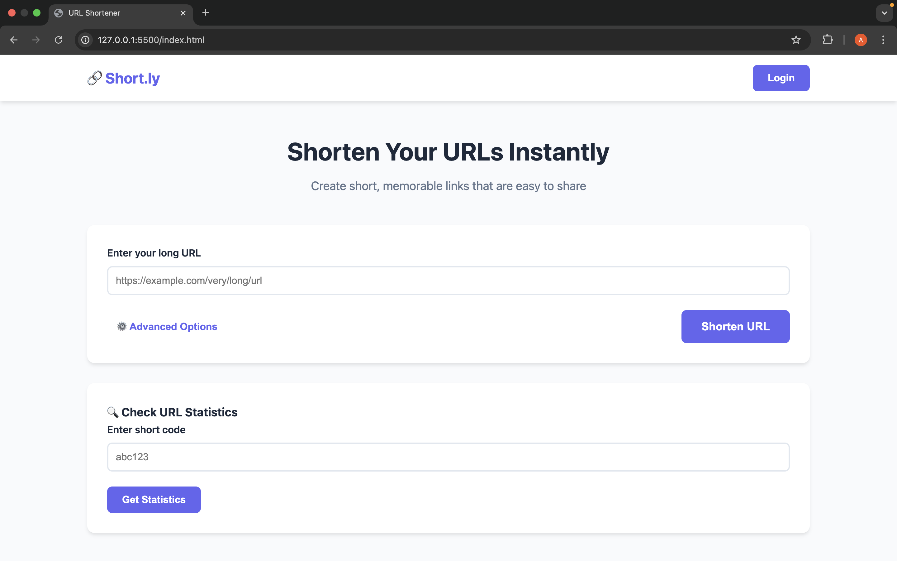

### Register view (filled)

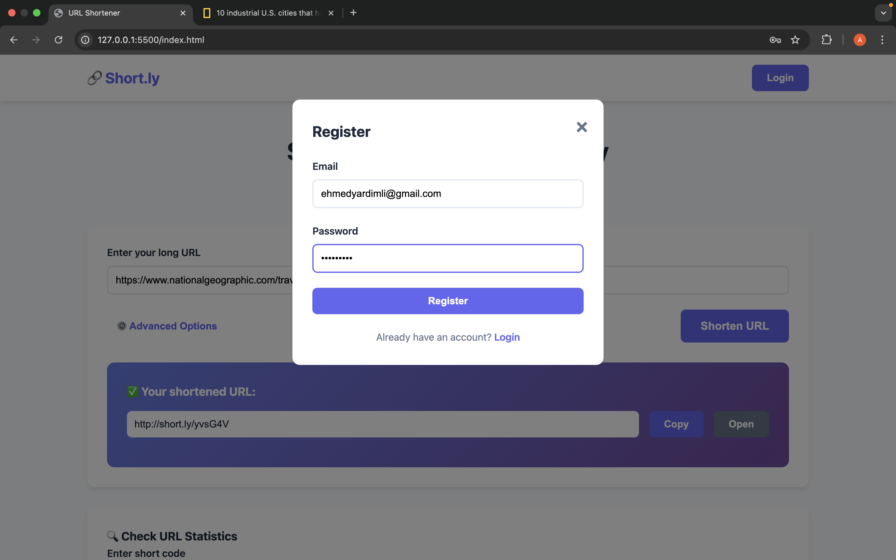

### Empty login view

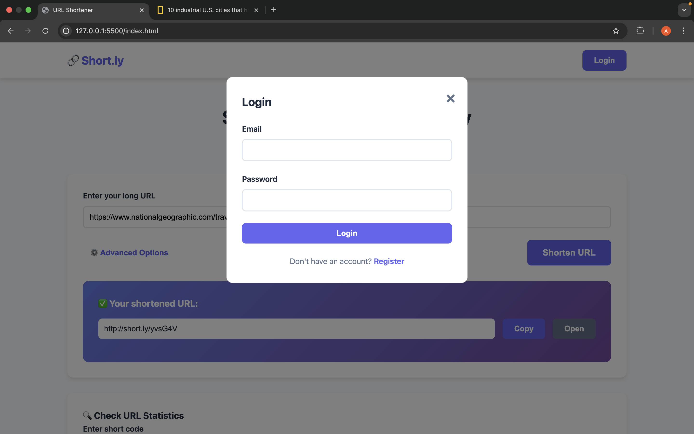

### Shorten (request & response, no auth)

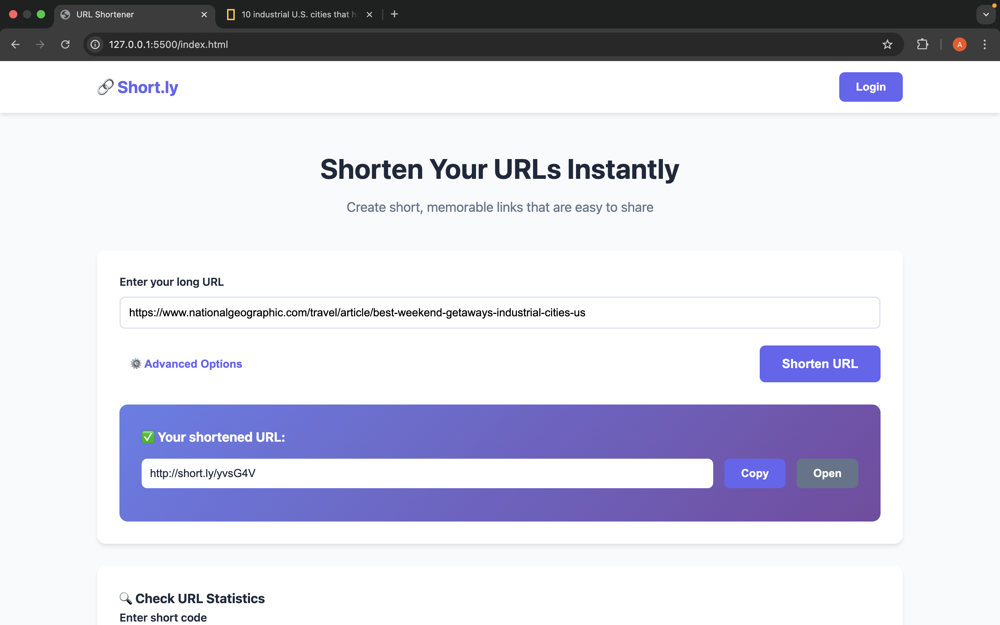

### Auth user — response UI after new shorten

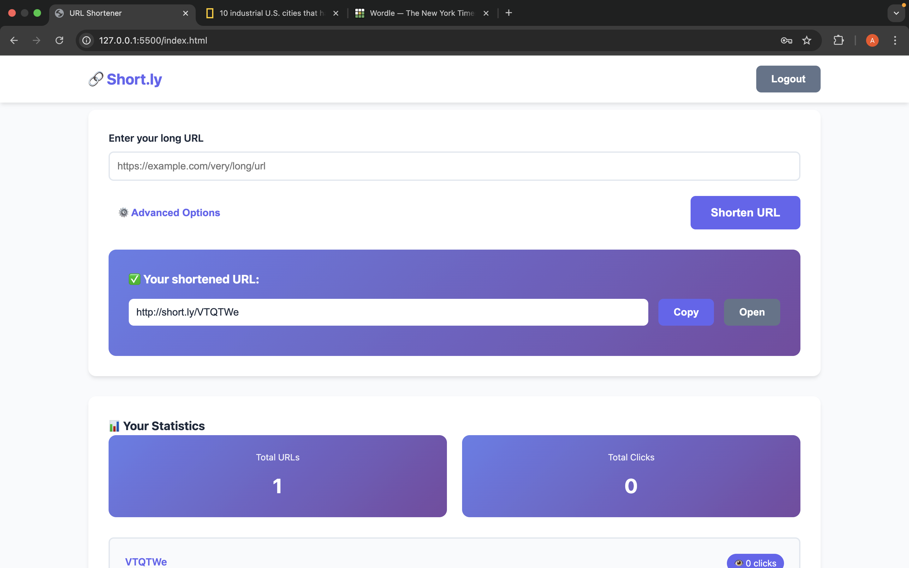

### Redirected page after clicking “Open”

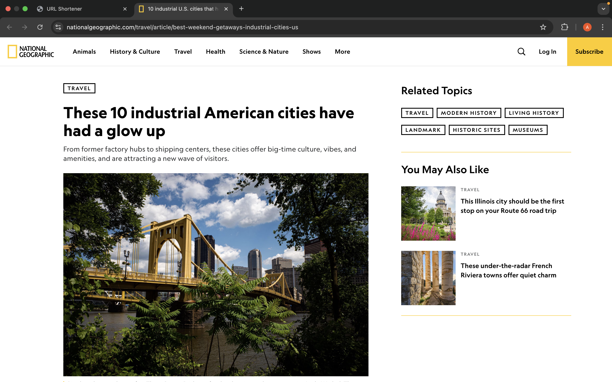

### Redirected after user — success register flow

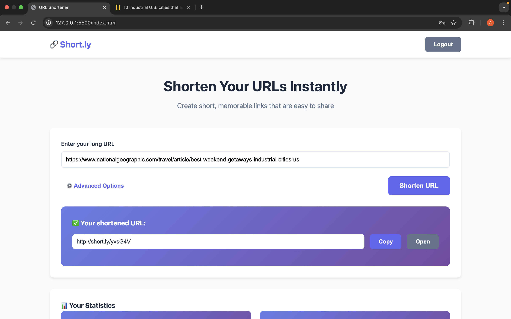

### Stats — short code UI

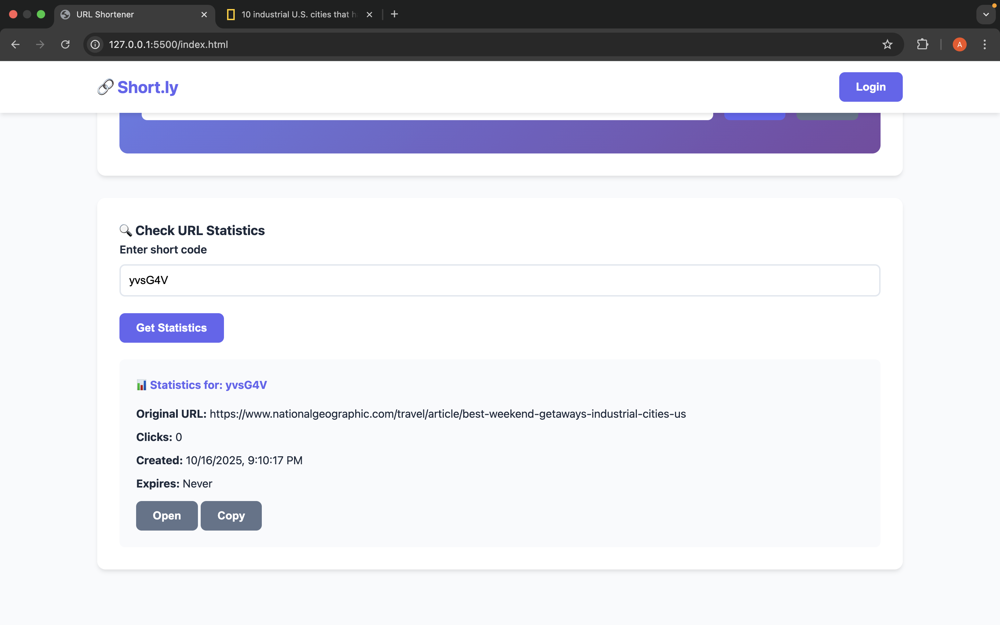

### Stats — short code after click


### See click numbers for stats/shortcode after clicks

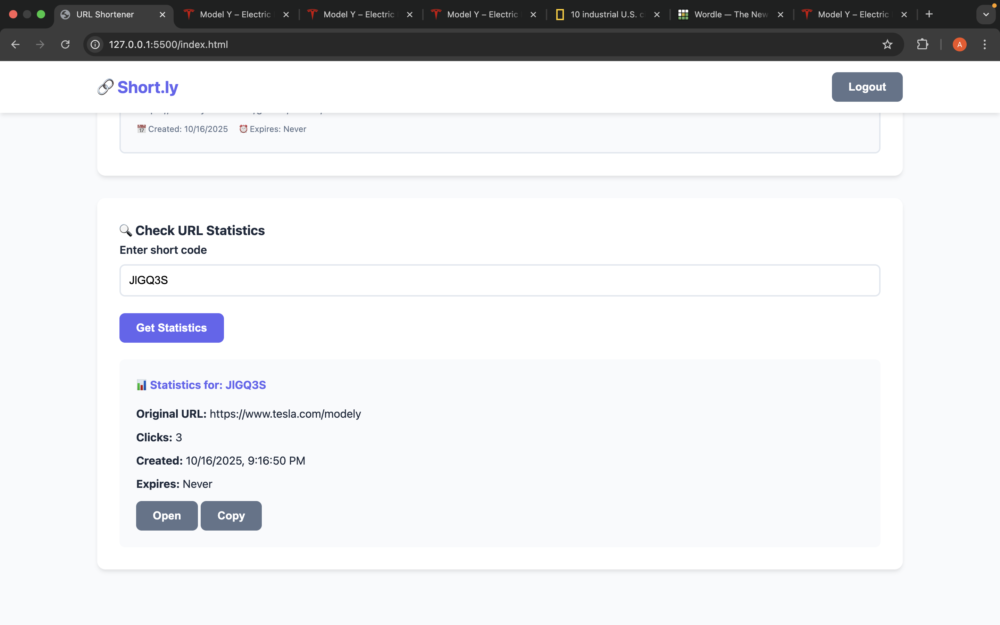

### After URLs and clicks — see total numbers

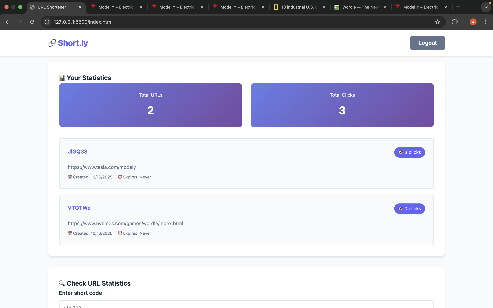

### Auth user — clicks “Open” and redirects to page


### Auth user — gets stats based on short code

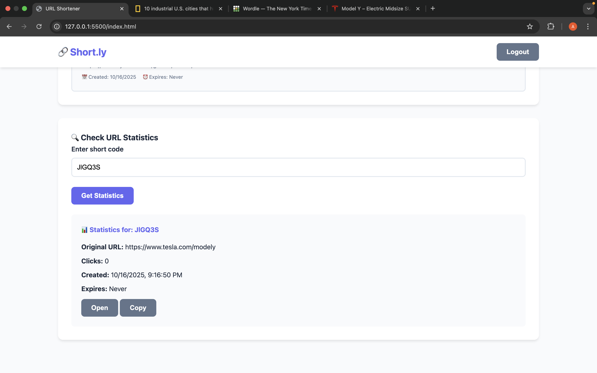

### Auth user — shortened another URL

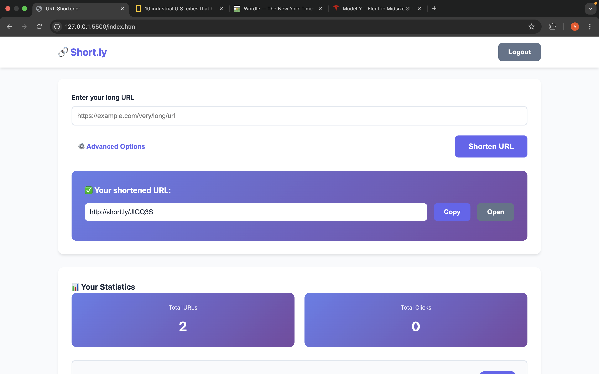

### Session expired message

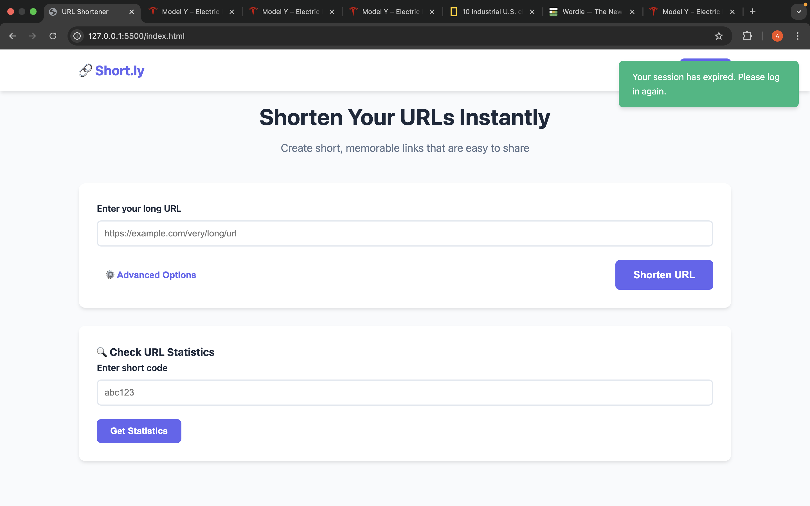

---

## Troubleshooting

* **“Cannot connect to server …”**
  Backend not running or CORS not allowing your origin.

* **Always logged out**
  Refresh token might be expired or invalid; login again. Check backend TTLs and system time.

  ```md
  
  ```

---

## License

[](https://github.com/ahmadyardimli/link-shortening-service-frontend/blob/master/LICENSE)
This project is licensed under the **Apache License 2.0** — see the [LICENSE](https://github.com/ahmadyardimli/link-shortening-service-frontend/blob/master/LICENSE) file for details.
